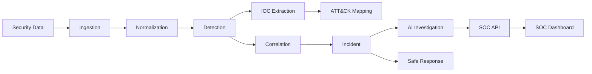

# AI SOC Analyst

**AI-assisted Security Operations Center platform for security detection, investigation, correlation, and safe response.**

## Quick Start

Run a deterministic automated threat simulation to populate the database:
```bash
python -m scenarios run multi_stage_attack
```

Start the backend API server:
```bash
python -m uvicorn api.app:app --reload
```

Start the frontend dashboard in a new terminal:
```bash
cd frontend
npm ci
npm run dev
```

*Note: The demo scenarios use deterministic, mock investigation behaviors to safely generate alerts and incidents without requiring a real network or live attacks.*

## Architecture



## Design Highlights

*   **Deterministic Detection**: Hardcoded, reliable correlation rules for baseline security threats.
*   **Idempotent Ingestion**: Pipeline design ensures logs and alerts can be re-processed safely without duplicating state.
*   **Evidence-bounded AI Investigation**: AI capabilities are restricted to synthesizing evidence presented; AI cannot alter logs or state directly.
*   **Deterministic Correlation**: Grouping of related alerts into incidents follows strict temporal and entity-based rules.
*   **Analyst-owned Incident State**: Security analysts retain final approval rights over AI recommendations and playbook actions.
*   **Explainable Risk Scoring**: Transparent formulas dictate alert confidence and incident risk levels.
*   **MITRE ATT&CK Mapping**: Detections are mapped directly to corresponding MITRE ATT&CK framework techniques.
*   **Simulation-only Response**: Response playbooks generate scripts but do not execute them automatically (simulation safe).
*   **Security-focused Input Validation**: Strict bounds on log formats, ingestion sizes, and character sets.
*   **Reproducible Scenarios**: Synthetic threat demos (e.g. `multi_stage_attack`, `brute_force`) verify pipeline behavior consistently.

## Features

### Detection
* Rule-based engine identifying credential stuffing, brute forcing, log clearing, and suspicious service exposure.
* Native detection modules for Windows Event Logs and syslog.

### IOC & ATT&CK
* Automated extraction of Indicators of Compromise (IPs, URLs, Accounts) from raw telemetry.
* Mapping of behaviors to Enterprise ATT&CK v19.2 (e.g. T1110, T1098).

### Correlation & incidents
* Temporal and entity-based clustering of isolated alerts into higher-fidelity, actionable incidents.
* Automated tracking of active incidents.

### AI investigation
* Integration with Ollama for offline LLM evaluation of incident narratives.
* Generation of human-readable summaries for complex, multi-stage attacks.

### SOC dashboard
* React/TypeScript frontend providing a comprehensive SIEM-like experience.
* Visualization of incidents, timelines, IOC relationships, and attack mappings.

### API
* FastAPI-driven backend supporting RESTful interactions for the dashboard and programmatic ingestion.

### Response/playbooks
* Safe simulated responses that propose and generate remediation steps (e.g., firewall block scripts) without automated execution.

### Security controls
* Extensive input sanitization, safe YAML parsing, and strictly-typed ingestion schemas.
* AI inputs are strictly constrained and validated.

### Testing
* Comprehensive suite spanning unit tests for detection logic and integration tests for the full pipeline.
* Reproducible end-to-end `smoke_test`.

### Performance
* Benchmarked to process 1000 events in ~2 seconds (Ingestion ~1.6s, Detection ~0.4s).

## ⚠️ Authorized-use Warning

This project is intended strictly for **defensive, educational, and authorized lab environments**. 
It includes defensive reconnaissance modules (like the Port Scanner) which must **only** be executed against networks and targets where you possess explicit administrative authorization. Do not run this platform or its sensors in unauthorized networks.

## MITRE ATT&CK Attribution

Portions of this project incorporate or reference the MITRE ATT&CK® framework. ATT&CK is a registered trademark of The MITRE Corporation. Static mapping catalogs included in this project reference Enterprise ATT&CK v19.2 data.
