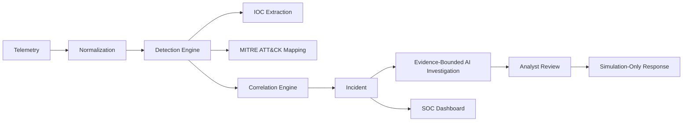

# AI SOC Analyst

**AI-assisted Security Operations Center platform for security detection, investigation, correlation, and safe response.**

## Project Status

This project is a defensive AI SOC platform designed for:
- Cybersecurity portfolio demonstration
- Educational use and security research
- Authorized security labs
- Synthetic attack simulation

It features a complete, end-to-end pipeline from telemetry ingestion through to safe, simulation-only response playbooks.

## Tech Stack

**Backend:**
- Python
- FastAPI
- SQLite

**Frontend:**
- React
- TypeScript
- Vite

**Security/AI:**
- Ollama (Local LLM integration)
- MITRE ATT&CK® mapping
- Deterministic detection rules
- Evidence-bounded AI investigation

**Testing:**
- Python `unittest`
- Frontend Vitest
- Integration & synthetic smoke tests

## Quick Start

### 1. Run the deterministic SOC demo

Generate synthetic telemetry to populate the database and demonstrate the detection → correlation → investigation pipeline:

```bash
python -m scenarios run multi_stage_attack
```
*Note: This demo uses deterministic/mock investigation behavior safely and does not attack real systems.*

### 2. Start the backend

```bash
python -m uvicorn api.app:app --reload
```
*(The backend defaults to running on http://127.0.0.1:8000)*

### 3. Start the frontend

Open a new terminal window:

```bash
cd frontend
npm ci
npm run dev
```
*(The dashboard will be available at http://127.0.0.1:5173)*

## How It Works



## SOC Workflow

The complete lifecycle of a security event in this platform:

```text
Telemetry               (Raw logs arrive: Syslog, Auth, Windows Events)
   ↓
Normalization           (Parsed into strict internal schema)
   ↓
Detection               (Deterministic rules flag malicious activity)
   ↓
IOC Extraction          (IPs, Domains, Accounts are safely extracted)
   ↓
ATT&CK Mapping          (Behaviors linked to MITRE ATT&CK catalog)
   ↓
Correlation             (Related alerts grouped by time and entity)
   ↓
Incident Creation       (High-level incidents created with risk scoring)
   ↓
Evidence Collection     (All related raw telemetry is gathered)
   ↓
AI Investigation        (LLM synthesizes narrative based ONLY on evidence)
   ↓
Analyst Review          (Human evaluates the incident via SOC Dashboard)
   ↓
Safe Response Recommendation (Playbook suggests remediation scripts safely)
```

## Dashboard Preview

<!-- Screenshot placeholder:
Capture the dashboard using synthetic demo data.
Do not include API tokens, local Windows paths, usernames, or personal information.
-->

## Design Highlights

### Deterministic Detection
Security detections are based on explicit rules and reproducible logic rather than relying solely on an LLM, reducing hallucinations.

### Idempotent Ingestion
Repeated log ingestion does not unnecessarily duplicate events or alerts.

### Deterministic Correlation
Related detections are grouped into incidents using explicit temporal, entity, and evidence relationships.

### Evidence-Bounded AI
The AI investigation layer reasons *only* over supplied evidence and validated context. The AI does not have unrestricted authority to query networks or modify system states.

### Analyst-Owned State
Analysts remain fully responsible for incident state and final response decisions.

### Explainable Risk Scoring
Incident risk is derived from explicit scoring factors (severity, confidence, frequency) rather than an opaque AI model score.

### MITRE ATT&CK Mapping
Detections are associated with Enterprise ATT&CK techniques where supported by the evidence and the internal mapping catalog.

### Simulation-Only Response
Response playbooks generate recommendations and scripts but *do not* automatically execute destructive or state-altering actions.

### Reproducible Scenarios
Synthetic scenarios allow the complete SOC pipeline to be demonstrated repeatedly and reliably.

## Features

### Detection
* Authentication attack detection (credential stuffing)
* Brute-force attempt detection
* Suspicious service exposure detection
* Audit/log clearing detection
* Windows Event Log analysis
* Syslog and auth log parsing

### IOC & ATT&CK
* IP extraction
* URL/domain extraction
* Relevant account extraction
* Indicator deduplication
* ATT&CK technique mapping backed by exact evidence matching

### Correlation & Incidents
* Temporal correlation of overlapping alerts
* Entity-based correlation (shared source IP, user, or host)
* Incident merging
* Deterministic incident identity tracking
* Explainable risk scoring and confidence levels
* Analyst-owned incident statuses

### AI Investigation
* Ollama local LLM integration
* Strictly evidence-bounded AI prompts
* Deterministic mock provider capability for testing/demos
* Investigation run tracking
* Strict validation of AI structured output

### SOC Dashboard
* **Alerts & Incidents Pages:** View active threat clusters and severity levels.
* **Incident Details:** Timeline visualization and MITRE mapping context.
* **IOC Explorer:** Track global indicators of compromise.
* **Investigation Viewer:** Review AI-generated narratives and mock playbooks.

### API
* FastAPI endpoints providing full RESTful access to the underlying pipeline and data model.

### Response
* **Simulation-Only Playbooks:** Response playbooks propose remediation steps but require analyst review. *They do not automatically execute remediation actions.*

## Design Decisions

1. **Why deterministic detection exists alongside AI:** Security detection requires absolute reliability, zero hallucinations, and low latency. AI is used to *explain* and *synthesize* the findings, not replace the sensor.
2. **Why AI is evidence-bounded:** To prevent hallucinated timelines or fake IOCs, the LLM is strictly constrained to only evaluate the telemetry provided in its context window.
3. **Why SQLite is currently used:** For a portable portfolio and educational project, SQLite eliminates complex external database dependencies while fully supporting the necessary relational schema.
4. **Why response is simulation-only:** Automated response is inherently dangerous. In a lab/educational context, executing real firewall blocks or account lockouts is a severe risk.
5. **Why deterministic correlation is preferred over LLM-based correlation:** Grouping alerts by precise timestamps and entity IDs is vastly faster, cheaper, and more accurate than asking an LLM to cluster raw data.
6. **Why analyst-owned state is important:** Security is fundamentally a human-driven process. The AI acts as a junior analyst, but the senior human analyst makes the final call.
7. **Why synthetic scenarios are used:** Real attacks on real infrastructure are hard to safely package. Synthetic deterministic data allows any user to clone and instantly see the full power of the platform safely.

## Why This Project?

This project was built to demonstrate full-stack engineering breadth across:
- Cybersecurity detection engineering and SIEM concepts
- Strict log ingestion and security analytics
- Incident correlation and threat intelligence mapping (MITRE ATT&CK)
- Safe, evidence-bounded LLM reasoning implementation
- REST API development (FastAPI)
- Frontend engineering (React, TypeScript)
- Comprehensive automated testing and secure software design

## Performance

*Local benchmark; results are environment-dependent and are not performance guarantees.*

* **Dataset:** 1000 events
* **Ingestion Time:** ~1.50 seconds
* **Detection Time:** ~0.35 seconds
* **Peak Memory:** ~7.3 MB
* **Database Size:** ~2.8 MB
* **OS:** Windows
* **Python Version:** 3.12+ (Compatible)
* **Storage:** SQLite 3

## Testing

The project maintains extensive automated test coverage ensuring pipeline reliability.

```bash
python -m unittest discover
```
> At the time of publishing, the backend test suite reports **139** passing tests.
> The frontend test suite reports **27** passing Vitest components.

## Known Limitations

* SQLite is currently utilized in a single-worker/local-oriented architecture and is not scaled for distributed enterprise ingestion.
* Ollama is the implemented real AI provider; other remote APIs are unsupported by default.
* External threat-intelligence or reputation API lookups are currently not performed.
* Docker verification may require environment-specific tuning and volume mapping.
* Backups are currently unencrypted and rely on the host environment's security.

## ⚠️ Authorized Use Only

This project is intended strictly for **defensive research, education, authorized security testing, isolated labs, and synthetic attack simulation.**

Any reconnaissance or scanning functionality (such as the included Port Scanner) must **only** be used against systems and networks for which you have explicit, documented administrative authorization. Do not run this platform or its sensors in unauthorized environments.

## MITRE ATT&CK Attribution

Portions of this project incorporate or reference the MITRE ATT&CK® framework. ATT&CK is a registered trademark of The MITRE Corporation. The static mapping catalog included in this project references Enterprise ATT&CK v19.2 data.
