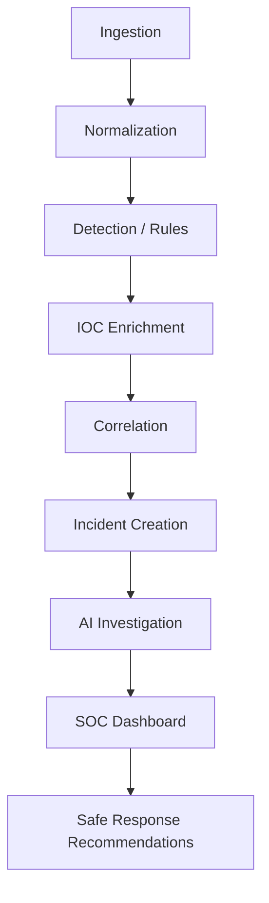

# Architecture

AI SOC Analyst is a defensive, educational SOC platform for authorized environments and synthetic laboratory data.

Deterministic security logic owns ingestion validation, detection, enrichment, correlation, evidence binding, policy checks, and response state transitions. AI is used for bounded investigation reasoning; its output is schema-validated and cannot override deterministic controls.

See [ingestion](ingestion.md), [detection](detection-phase3.md), [enrichment](ioc-enrichment.md), [correlation](correlation.md), [investigation](investigation.md), [API](api.md), and [response](response.md).

The current persistence layer is SQLite schema version 9. The current container model intentionally runs one backend worker because SQLite WAL files and locking are local-volume concerns.
